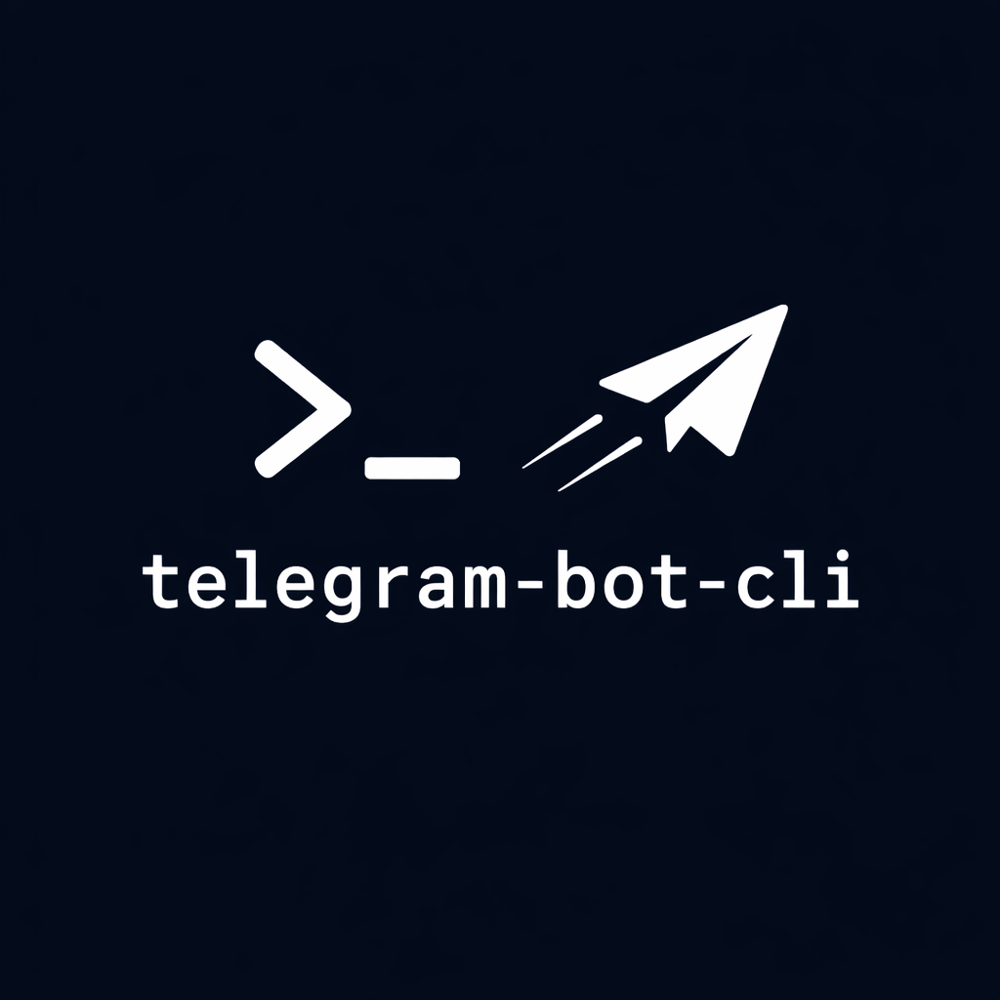

<p align="center">
  
</p>

<h1 align="center">telegram-bot-cli</h1>

<p align="center">A CLI for sending messages to Telegram. For Mac OS.</p>

<p align="center">
  <a href="https://github.com/lexler/telegram-bot-cli/actions/workflows/build.yml"></a>
</p>

## Installation

Download the latest binary from [GitHub Releases](https://github.com/lexler/telegram-bot-cli/releases).

```bash
# Mac Apple Silicon
curl -L https://github.com/lexler/telegram-bot-cli/releases/latest/download/telegram-bot-cli-mac-apple-silicon -o telegram-bot-cli

# Mac Intel
curl -L https://github.com/lexler/telegram-bot-cli/releases/latest/download/telegram-bot-cli-mac-intel -o telegram-bot-cli

chmod +x telegram-bot-cli
mv telegram-bot-cli /usr/local/bin/
```

## Quick start

```bash
telegram-bot-cli auth           # Set your bot token
telegram-bot-cli status         # Verify it works
telegram-bot-cli trace          # Discover your chat ID
telegram-bot-cli send -m "hi"  # Send a message
```

## Getting a bot token

1. Open Telegram, search for `@BotFather`
2. Send `/newbot`
3. Give it a name and username (must end in `bot`)
4. BotFather replies with your token

## Usage

See the [User Guide](docs/guide.md) for full documentation.
